# Sports News and Scores Dashboard

The Sports News and Scores Dashboard is a web application that provides users with up-to-date sports news articles and live scores for various sports. It allows users to stay informed about their favourite sports, read news articles, and track live match scores, all in one place. Additionally, users can personalize their dashboard by selecting their favourite sports or teams to receive tailored news and score updates.

This unified proposal combines the ability to browse sports news and scores with the option to personalize the dashboard through account creation and customization of preferences. Users can filter news articles, search for specific articles, and view live scores, all while having the ability to personalize their dashboard according to their preferences

Link: https://roaring-lokum-e2f83e.netlify.app

Intriduction Video: 

## High-level features
There are four high-level features that implemented:

### Browse Sports News
+ Users should be able to view a list of sports news articles.
+ Each news article should display the title, summary, and thumbnail image.
+ Users should be able to click on a news article to read the full content.

### Filter News Articles
+ Users should have the ability to filter news articles by sport.
+ The filtered news articles should dynamically update without a page reload.

### View Live Scores and Match Details
+ Users should be able to see a list of ongoing matches and their respective scores.
+ Each match should display the teams playing, the current score, and other relevant match details.
+ Users should have the option to manually refresh the scores.

### Personalize Dashboard
+ Users should be able to create an account and sign in to the dashboard.
+ Signed-in users should have the ability to customize their dashboard preferences.
+ Preferences may include selecting favourite sports or teams to receive tailored news and score updates.

# Screen Shots:
### Landing Screen (As a Guest)
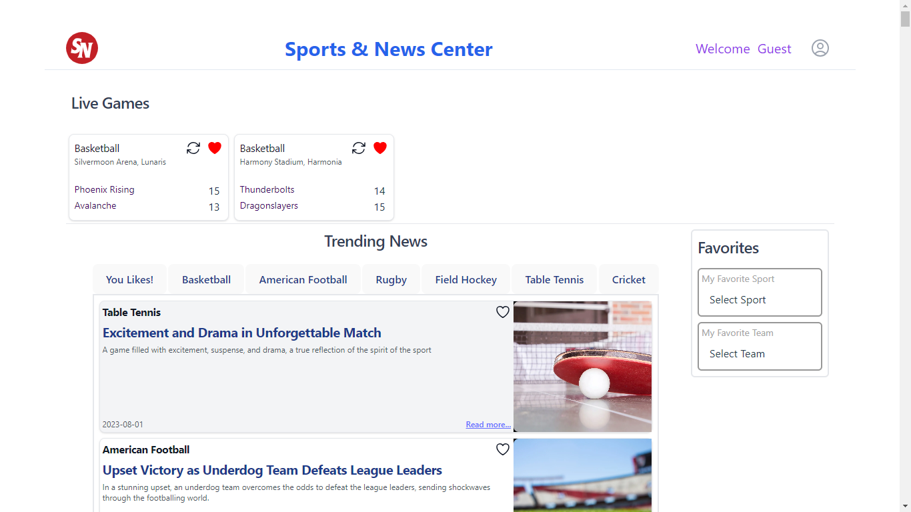

### Live Matches Scores
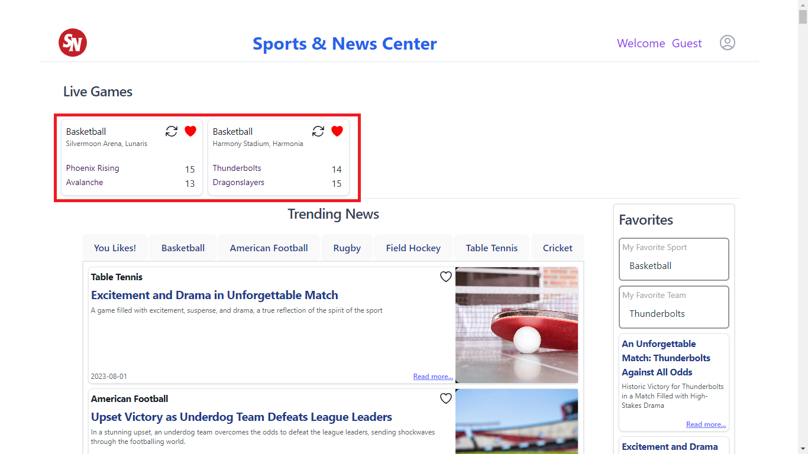

### Refresh Live Match Score
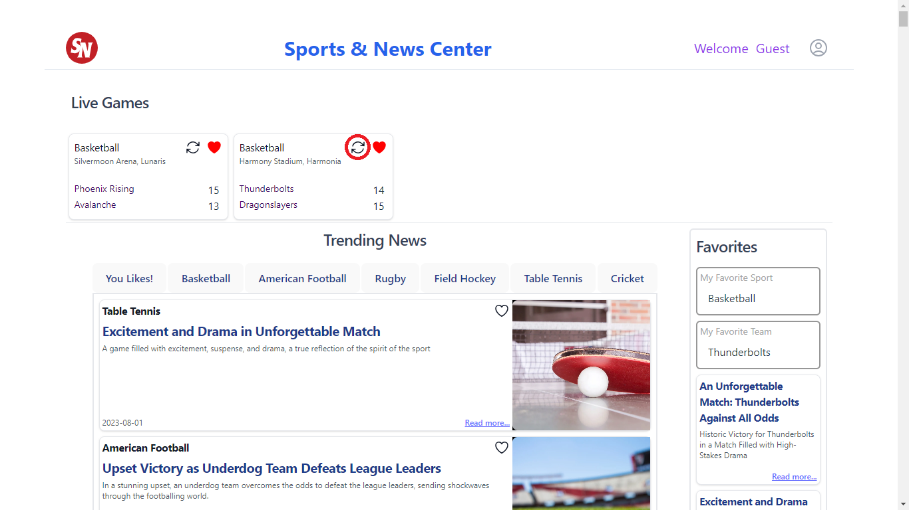

### Save Favorite Matches and News
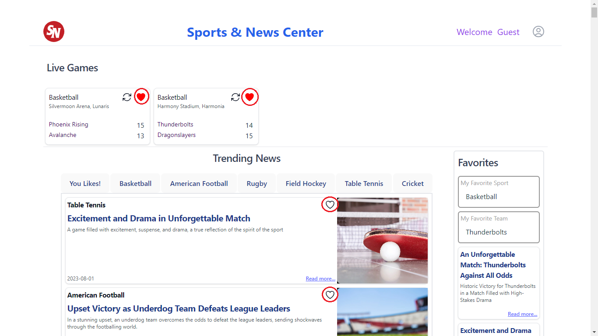

### Specific Sport News
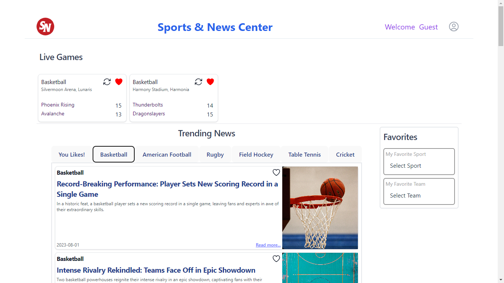

### Detail Sport News
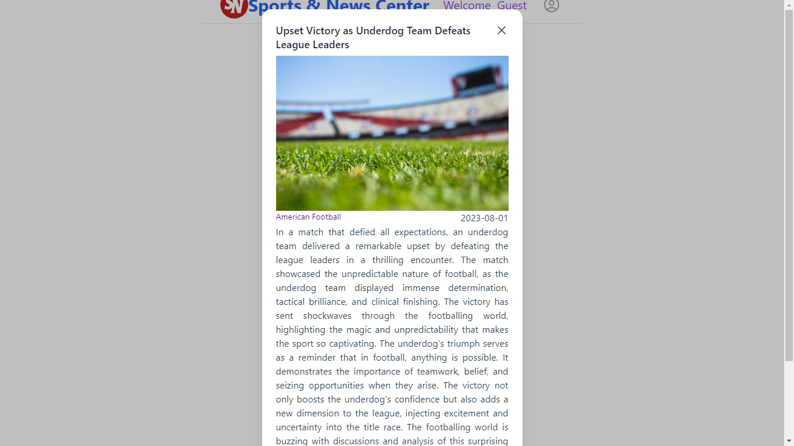

### Filtered News by Sport and Team
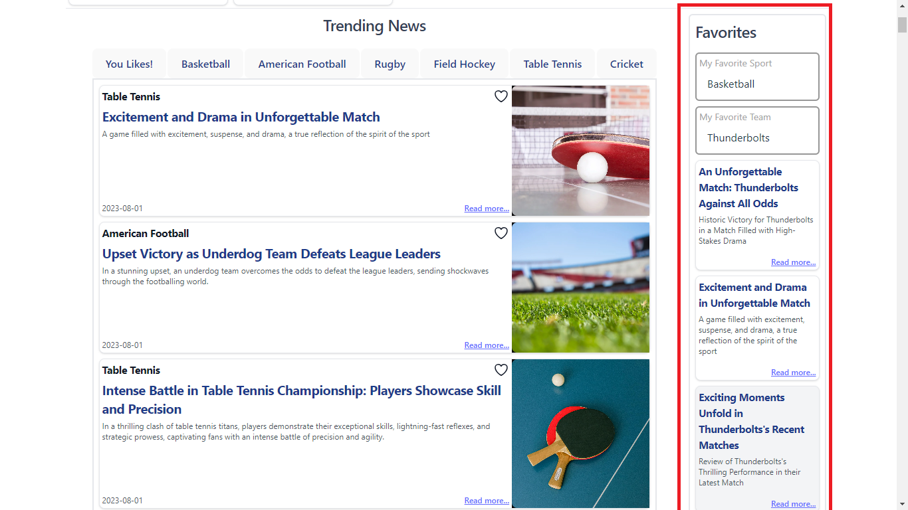

### Sign In and Sign Up
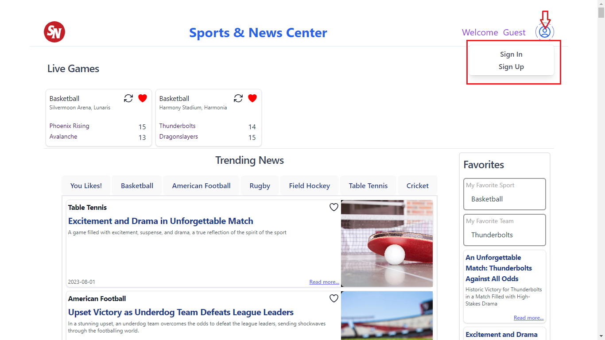

### Sign Up Form
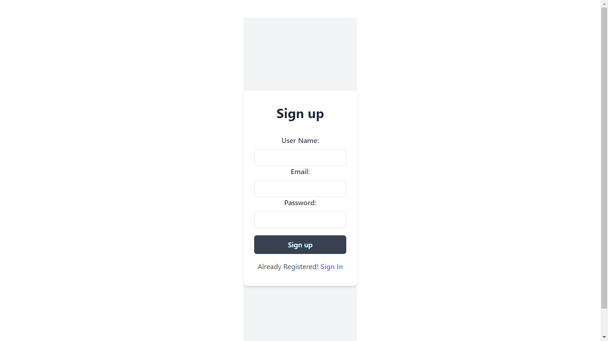

### Sign In Page

### Looged In User Landing Screen
Because of first time logging, User have not selected any preferences, "No Trendingd News For You!" meessage display, means no filtered news according to your interest.

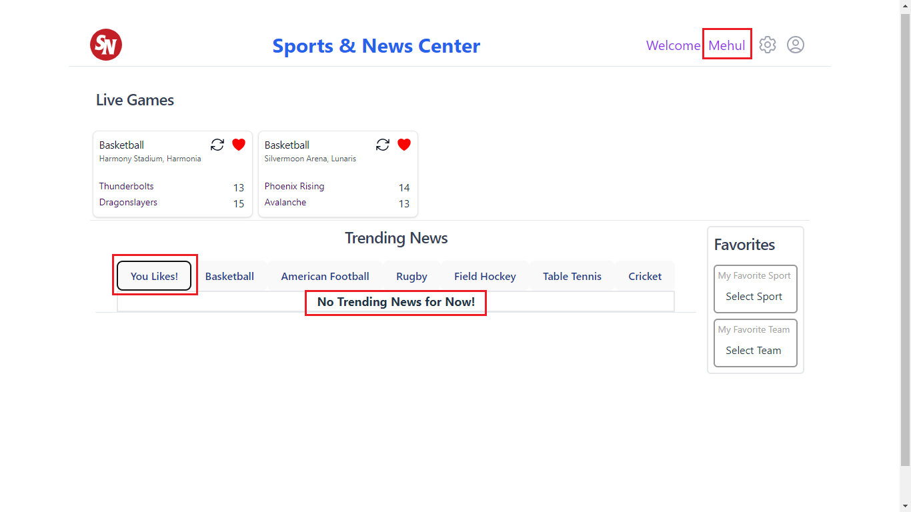

### User's Interesting Preferences for Sports and Teams
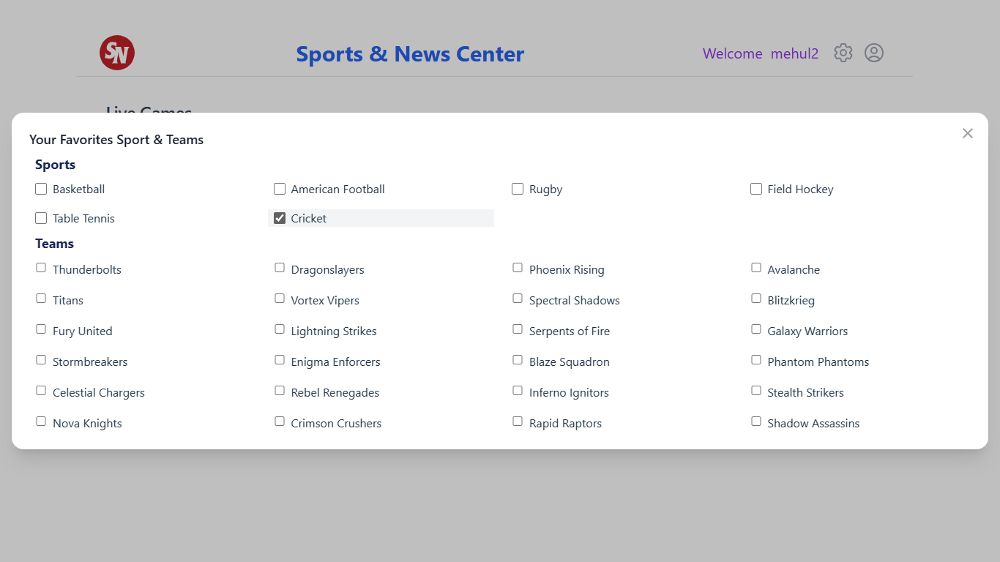
 
### You Likes! (According to User Preferences)
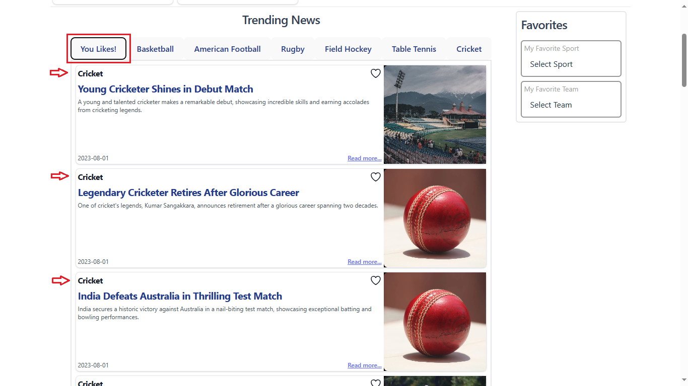

### Option for Logged Users
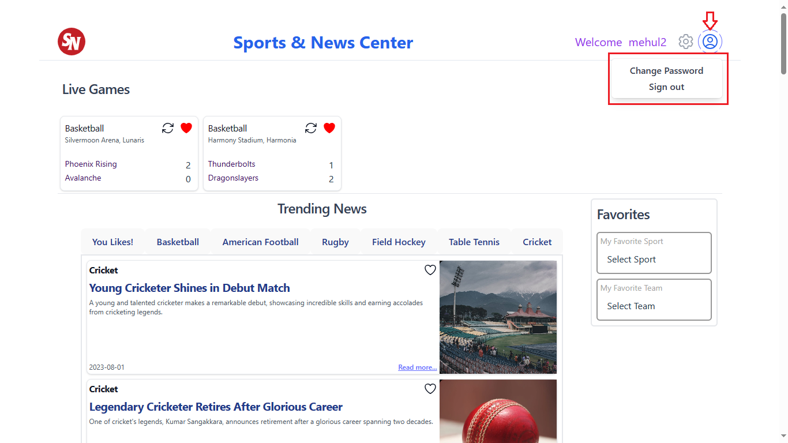

### Changed Password
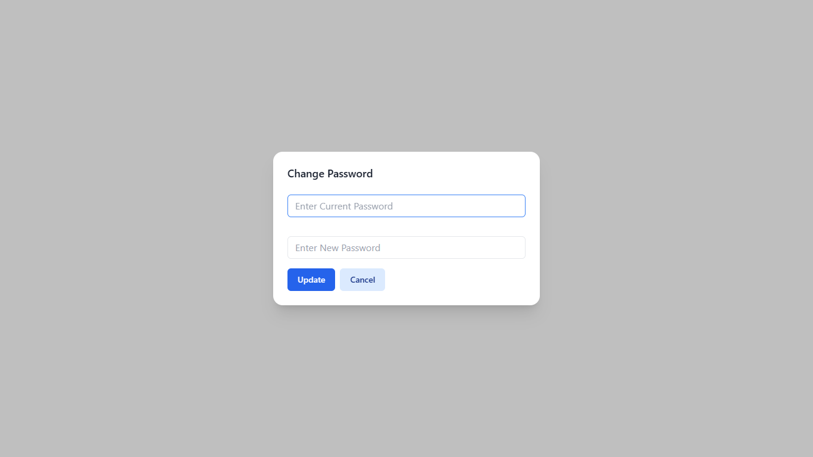

# Implementation

Download the Source Code
[Link](https://github.com/spcevng-ac-in/sport-news.git)

Pre-requisite: 

NodeJS 

Install required packages

    npm run install

Run Application

    npm run dev